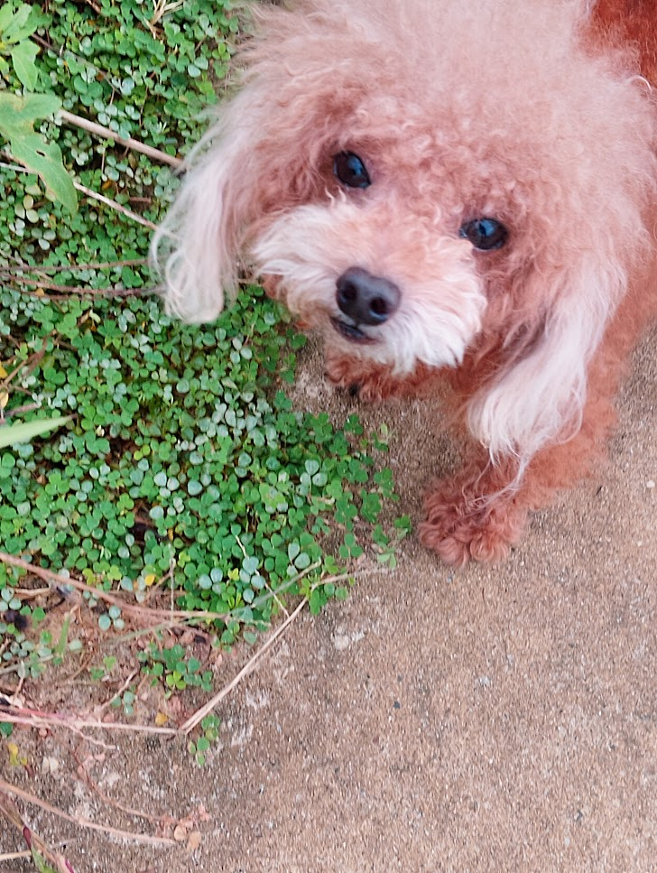

# sidebar_ai_extension (IN PPENDING UPDATES)
## Boredom + AI = This Cursed Little Project

So I had way too much free time and zero self-control, so naturally I teamed up with an AI to birth this thing into existence. You're welcome.

## How to Actually Install This Thing

Step 1 – The Frontend

Grab the latest release right here [dist.zip](https://github.com/VerNguyen2028/sidebar_ai_extension/releases/latest). Then drag it into your browser's extensions page under Developer Mode — you know the drill, it's basically the same everywhere. Congrats, you now have a sidebar that looks great but does absolutely nothing. Cool. Don't touch it yet.
        
Step 2 – The Backend
 
Clone the backend repo, then sit there and wait like a medieval peasant while it downloads. Run npm install to grab the dependencies, slap in your own API key, and fire it up with node index.js.         Now that sidebar?

## Miscellaneous Life Advice & Semi-Important Notes

- The AI model in use is Gemini 2.5 Flash. If you're swimming in money, feel free to upgrade to a Pro model. Just tweak the backend code and go nuts.
- Because token is limited,I added attach web context feature, you need to highlight the area that you want to send to AI. If not and so on, all the content of the web will be sent. **Be carefull!!!**
- Flash models have quota limits — shocking, I know. When you hit the wall, just swap in a new Gemini API key. Ask a friend, a colleague, your dealer, whoever.
- Too lazy to manually start the backend every time? Same, honestly. Use **PM2 + WATCH** on Windows or **SYSTEMD + NODEMON** on Ubuntu to auto-start it like a civilized human. For Mac users... I genuinely have no idea, ask someone else or ask an AI.

## What hell errors you might encounter 

400, 402, 403 — Your API key is wrong or you passed in nonsense.

404 — The AI model you asked for doesn't exist.

429 — You've burned through your quota. Slow down, champ.

500 — Google Gemini had a moment..

503 — Gemini is either down or getting absolutely slammed by traffic. Touch grass and try again later.

## Have a nice day 😄😄😄

- 

